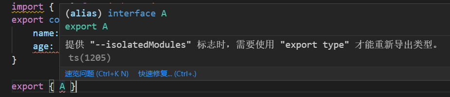
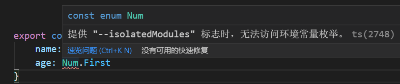
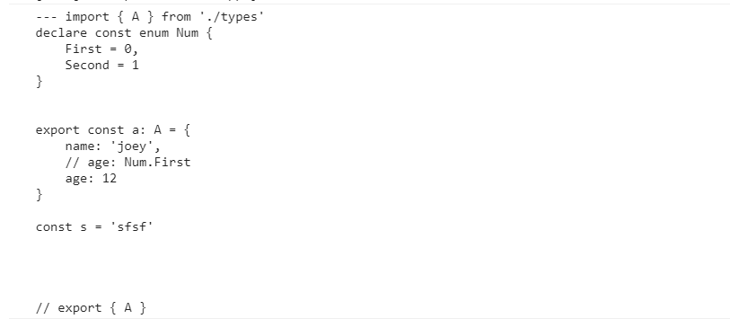
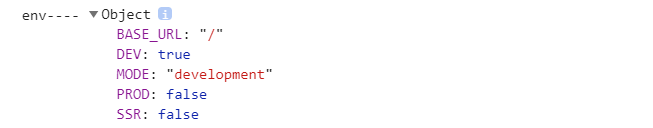
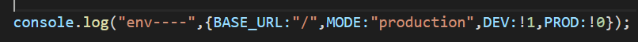

前面的丢了， fuck

### 创建 vue3 项目

```sh
1. npm init @vitejs/app
2. 给项目命名
2. 选择 vue  // 选择 vanilla（原生的，普通的） 就是不选择任何框架，可以用于创建vue2项目
```


vite 在开发中使用 esbuild ，打包构建时使用 rollup ；

安装需要使用 yarn， 使用 npm 时 会有 esbuild 报错 ，可以在项目中加上 only-allow 

```json
"scripts": {
   "preinstall": "npx only-allow yarn",
},
```

#### 支持vue3 的 jsx

需要 安装 @vitejs/plugin-vue-jsx 

#### 支持vue2项目

安装 vite-plugin-vue2

```sh
yarn add vite-plugin-vue2 -D
yarn add  vue@2.6.1 -S
```

```js
import {createVuePlugin} from "vite-plugin-vue2"
export default {
    plugins:[createVuePluginP()]
}
```


#### 支持 css 

1. 支持原生 css 变量

   css 变量兼容性很好，可以支持 ie9

   ```css
   :root{
       --main-bg-color: red
   }
   .root{ 
       color: var(--main-bg-color)  
   }
   ```

   

2. 支持原生 @import url() 语法，其中 less 和 sass 支持 alias 路径， stylus 不支持 alias 路径；

   ```js
   resolve: {
       alias: {
         '@styles': '/src/styles' // 第一个 / 表示项目根目录
       }
     }
   ```

   

   ```css
   @import url('@styles/other.css');
   ```

3. 支持 postcss

   在根目录下建一个 postcss.config.js ， vite 会默认识别；可以安装插件来实现自己需要的功能；

   ```js
   module.exports = {
       plugins: [
           require('@postcss-plugins/console') // 在编译css 文件时进行输出
       ]
   }
   ```

   使用 postcss 插件

   ```css
   // 使用
   
   @import url('@styles/other.css');
   
   :root{
       --main-bg-color: red
   }
   
   .root{ 
       color: var(--main-bg-color)   
   }
   @console.error 编译 index.css
   ```

   

4. 对 less 等预先编译器，只需要安装即可使用；

   ```sh
   yarn add less -D
   ```

5. 支持 css-module， 直需要将 css 文件名改为 xxx.module.css 即可, 其他写法和 css 一致；

   ```jsx
   import classes from '@styles/test.module.css'
   export default defineComponent({
       setup() {
           return () => {
               return <div class={`root ${classes.moduleClass}`}>hello vue3 vite</div>    
           }
       }
   })
   ```

6. 支持 postcss 

#### 支持 ts

```sh
yarn add typescript -D
tsx --init
```

vite 对 ts 只编译，不校验，即使又错误的属性也会照常编译，我们可以在构建前手动校验，如下， && 是串行， & 是并行；

```json
"scripts": {
    "build": "tsc --noEmit && vite build",
},
```

#### 支持 vue 文件中的 ts 

用 vue-tsc 来校验 .vue 文件中的 ts  ；

```sh
yarn add vue-tsc -D
```

然后在构建时添加校验

```json
"scripts": {
    "build": "vue-tsc --noEmit && tsc --noEmit && vite build",
},
```


### tsconfig 中的一些属性

#### 1. isolatedModules 属性

1. tsconfig 中 compilerOptions 下此属性默认，设为false 时,  对于 import 某个 ts 类型，在在同文件中 export 出去，会在浏览器中报错，也就是不支持；因为编译以后会去掉类型，再导出，就会报错，且代码中没有提示。如下：

   ```ts
   import { A } from './types'
   export const a: A = {
       name: 'joey',
       age: 20
   }
   
   export { A }
   ```

   设为 true 以后，就会在编辑器中给以提示，不要 export 出去，同时在构建时也会提醒；
   
   

2.  对于 枚举 enum， 不开启此属性时，将常量枚举当作数字使用，不会有提示。而在实际编译中，枚举会被编译成常量，已经不能用xxx. yyy 的方式引用了；开启此属性后就会有提示；

   ```ts
   export const a: A = {
       name: 'joey',
       age: Num.First
   }
   ```

   

   

3. 开启此属性后，ts 会强制在每个 ts 文件中加入 export  或者 import ，让此文件变成 module， 否则就会爆红提示；

#### 2. types

```json
"types": [
    "vite/client"
],
```

可以在输入 import.meta 时直接给予类型提示，也可以在引用 png 等静态文件时会给出类型提示； png 会被当作 string 类型；

- ##### ?url 后缀

  在文件路径后加 url ，导入得到的不再是是esm 对象，而是一个静态资源的路径；

  ```js
  import test from './test.ts?url'
  test 是 "/src/test.ts" 路径，相对于根目录；
  ```

- ##### ?raw  后缀

  会将整个文件的代码以字符串的形式导入，而不是对象；

  ```js
  import test from './test.ts?raw'
  ```

  

- ##### 支持 webworker

  可以让代码在 webwoker 中运行；在vite 项目中，worker 是一个 js 或 ts 文件，于其他文件没有区别，在导入使用时去掉 js 后缀，然后加上 ``?worker ``即可让 vite 识别；

  ```js
  // worker.js
  
  postmessage('我是worker')
  ```

  

  ```js
  // 使用 worker 
  import Worker from './worker?worker'
  const worker = new Worker();
  worker.onmessage = (e)=>{
      console.log(e.data)
  }
  ```

- ##### 支持 json 

  导入 json 文件会得到一个 对象，可以以属性的方式使用其中信息；也可以解构赋值来使用

  ```js
  import {name} from '../package.json'
  console.log(name)
  ```

- ##### 支持 web assembly 

  对  .wasm 文件 以导入，会得到一个 promise ，其结果是一个对象, 就是 wasm 模块中导出的内容；

  ```js
  import wasm from "../fib.wasm"
  wasm().then(m=>{
      m.xxx
  })
  ```

  

- ### 环境变量

  从 import.meta.env 可以获取默认四个变量；

  

​       其中 mode 变量在 build 以后会变成 字符串，构建后默认是 **production ** ，其他几个也会变成对应的值；

​		

- .env 文件可以拿到自定义变量，需要加上前缀 **VITE_** , 如 VITE_TITLE , 只要环境对应上了，就能到 **import.meta.env**  上获取到 ；

- 可以使用 **.env.development.local** 文件来对应本地开发 , 可以在其中加上开发时独有的变量；

- 可以指定 环境变量

  如下会对应上 .env.test 文件中的变量；

  ```sh
  "scripts":{
  "dev": "vite --mode test"
  }
  
  ```


### 热更新 HMR


- ### 关于 eslint 配置和 git hook

  yarn add eslint-config-tandard eslint-plugin-import eslint-plugin-promise eslint-pugin-node  -D

  ts 支持

  @typescript-eslint/eslint-plugin@latest  @typescript-eslint/parser@latest eslint@latest 

npm init @eslint/config  === eslint --init

  Airbnb: https://github.com/airbnb/javascript
  Standard: https://github.com/standard/standard

Google: https://github.com/google/eslint-config-google

 XO: https://github.com/xojs/eslint-config-xo

 @typescript-eslint/eslint-plugin@latest @typescript-eslint/parser@latest  eslint@latest


@typescript-eslint/eslint-plugin@latest eslint-config-airbnb-base@latest eslint@^7.32.0 || ^8.2.0 eslint-plugin-import@^2.25.2 @typescript-eslint/parser@latest


